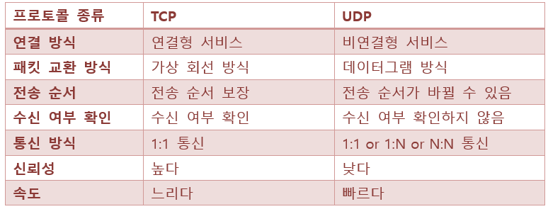

## TCP & UDP란
    - 데이터를 보내기 위해 사용하는 프로토콜

### TCP

- 인터넷상에서 데이터를 메세지의 형태로 보내기 위해 IP와 함께 사용하는 프로토콜

### **TCP 특징**

- 연결형 서비스로 가상 회선 방식을 제공한다.

- 3-way handshaking과정을 통해 연결을 설정하고 4-way handshaking을 통해 해제한다.

- 흐름 제어 및 혼잡 제어.

- 높은 신뢰성을 보장한다.

- UDP보다 속도가 느리다.

- 전이중(Full-Duplex), 점대점(Point to Point) 방식.

- TCP가 가상 회선 방식을 제공한다는 것은 발신지와 수신지를 연결하여 패킷을 전송하기 위한 논리적 경로를 배정한다는 말입니다. 그리고 3-way handshaking과정은 목적지와 수신지를 확실히 하여 정확한 전송을 보장하기 위해서

- 세션을 수립하는 과정을 의미합니다. TCP가 이러한 특징을 지니는 이유는 간단명료합니다.

- 바로 TCP는 연결형 서비스로 신뢰성을 보장하기 때문입니다. 그래서 3-way handshaking의 과정도 사용하는 것이고, 데이터의 흐름제어나 혼잡 제어와 같은 기능도 합니다. 하지만 이러한 기능때문에 UDP보다 속도가 느리게 됩니다. (이러한 기능은 CPU를 사용하기 때문에 속도에 영향을 주는 것입니다.)

- 그렇기에 TCP는 연속성보다 신뢰성있는 전송이 중요할 때에 사용하는 프로토콜입니다!

### **TCP 서버의 특징**

- 서버소켓은 연결만을 담당한다.

- 연결과정에서 반환된 클라이언트 소켓은 데이터의 송수신에 사용된다형 서비스로 가상 회선 방식을 제공한다.

- 서버와 클라이언트는 1대1로 연결된다.

- 스트림 전송으로 전송 데이터의 크기가 무제한이다.

- 패킷에 대한 응답을 해야하기 때문에(시간 지연, CPU 소모) 성능이 낮다.

- Streaming 서비스에 불리하다.(손실된 경우 재전송 요청을 하므로)

### UDP

데이터를 데이터그램 단위로 처리하는 프로토콜

### **UDP 특징**

- 비연결형 서비스로 데이터그램 방식을 제공한다

- 정보를 주고 받을 때 정보를 보내거나 받는다는 신호절차를 거치지 않는다.

- UDP헤더의 CheckSum 필드를 통해 최소한의 오류만 검출한다.

- 신뢰성이 낮다

- TCP보다 속도가 빠르다

- UDP는 비연결형 서비스이기 때문에, 연결을 설정하고 해제하는 과정이 존재하지 않습니다. 서로 다른 경로로 독립적으로 처리함에도 패킷에 순서를 부여하여 재조립을 하거나 흐름 제어 또는 혼잡 제어와 같은 기능도 처리하지 않기에 TCP보다 속도가 빠르며 네트워크 부하가 적다는 장점이 있지만 신뢰성있는 데이터의 전송을 보장하지는 못합니다. 그렇기 때문에 신뢰성보다는 연속성이 중요한 서비스 예를 들면 실시간 서비스(streaming)에 자주 사용됩니다.

### **UDP 서버의 특징**

- UDP에는 연결 자체가 없어서(connect 함수 불필요) 서버 소켓과 클라이언트 소켓의 구분이 없다.

- 소켓 대신 IP를 기반으로 데이터를 전송한다.

- 서버와 클라이언트는 1대1, 1대N, N대M 등으로 연결될 수 있다.

- 데이터그램(메세지) 단위로 전송되며 그 크기는 65535바이트로, 크기가 초과하면 잘라서 보낸다.

- 흐름제어(flow control)가 없어서 패킷이 제대로 전송되었는지, 오류가 없는지 확인할 수 없다.

- 파일 전송과 같은 신뢰성이 필요한 서비스보다 성능이 중요시 되는 경우에 사용된다.

### TCP와 UDP 비교
