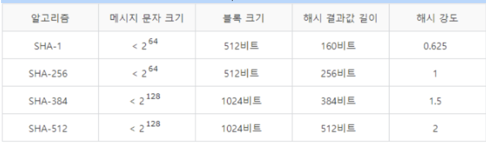

### Map에 대해서는 [여기](https://2oneweek.dev/common/algorithm/map-and-object)에 있습니다.

## Map

- Map은 key와 value를 가진 집합이며, 중복을 허용하지 않는다.

### HashMap

- HashMap은 Map interface를 implements 한 클래스로서 중복을 허용

- Map의 특징인 key와 value의 쌍

- key 또는 value 값으로써 null을 허용

- 검색 성능이 O(1)인 HashMap을 사용하는 것이 제일 좋음

### 해시 함수

#### 해시 함수의 정의

- 데이터의 효율적인 관리를 목적으로 임의의 길이의 데이터를 고정된 길이의 데이터로 매핑하는 함수

- 매핑 전 `원래 데이터의 값을 키(Key)` → 매핑 후 데이터의 값을 `해시값(Hash value)` 또는 `해시코드`

- 매핑하는 과정 자체를 `해싱(hashing)`

- **해시함수의 종류** : MD1, MD4, MD5, SHS, SHA-1, HAS-160

#### 해시함수를 만드는 방법

- division method

    - 나눗셈법은 간단하면서도 빠른 연산이 가능한 해시함수

    - 숫자로 된 키를 해시테이블 크기 m으로 나눈 나머지를 해시값으로 반환

    - m은, 대개 소수(prime number)를 쓰며 특히 2의 제곱수와 거리가 먼 소수를 사용

    - 해시함수 특성 때문에 해시테이블 크기가 정해진다는 단점

- multiplication method

    - 숫자로 된 키가 k이고 A는 0과 1 사이의 실수일 때 곱셈법

    - h(k)=(kAmod1)×m

    - 2진수 연산에 최적화한 컴퓨터 구조를 고려한 해시함수

- universal hasing

    - 다수의 해시함수를 만들고, 이 해시함수의 집합 H에서 무작위로 해시함수를 선택해 해시값을 만듬

    - H 에서 무작위로 뽑은 해시함수가 주어졌을 때 임의의 키값을 임의의 해시값에 매핑할 확률을 1/m로 만드려는 것이 목적

    - H를 구하는 것은 수학적으로도 증명이 되어있음

- SHA(Secure Hash Algorithm)

    - SHA(Secure Hash Algorithm)알고리즘은 미국 NSA에 의해 만들어짐

    - 160비트의 값을 생성하는 해시 함수로, MD4가 발전한 형태

    - MD5보다 조금 느리지만 좀 더 안전한 것으로 알려져 있으며, SHA에 입력하는 데이터는 512비트 크기의 블록이며 알고리즘의 동작원리는 아래의 그림과 같음

    

#### 해시 충돌을 탐사(probing)을 통하여 해결

- 선형 탐사(Linear probing)

    - 데이터가 있으면 고정폭으로 또 옮겨 액세스

    - 특정 해시값 주변 버킷이 모두 채워져 있는 primary clustring 문제에 취약

- 제곱 탐사(Quadratic probing)

    - 고정 폭으로 이동하는 선형 탐사와 달리 그 폭이 제곱수로 늘어난다

    - 하지만 제곱탐사는 여러 개의 서로 다른 키들이 동일한 초기 해시값을 갖는 secondary clustering에 취약

- 이중해싱(double hashing)

    - 탐사할 해시값의 규칙성을 없애버려서 clustering을 방지하는 기법

    - 2개의 해시함수를 준비해서 하나는 최초의 해시값을 얻을 때, 또 다른 하나는 해시충돌이 일어났을 때 탐사 이동폭을 얻기 위해 사용

    - 탐사 이동폭이 같더라도 최초 해시값이 달라져 primary, secondary clustering을 모두 완화

**HashMap 성능을 확인하기 위해서 충돌 횟수가 적어야하며, 특정 key로 해시가 몰리면 안된다.** ~~얼마전에, 쿠*에서 Redis에서의 key값이 넘쳐서 에러가 생긴적이 있다.~~

 

#### 그래서 해쉬함수는 어디에 쓰이는가?

- 중복없는 unique한 정보가 필요할 때,

    - Git commit 정보

    - 블록체인 정보

- 데이터가 훼손되지 않음을 보장해야할 때, 

    - 전자서명

    - 인증용 토큰 (JWT)에서 Signature
    
- 브라우저의 local storage