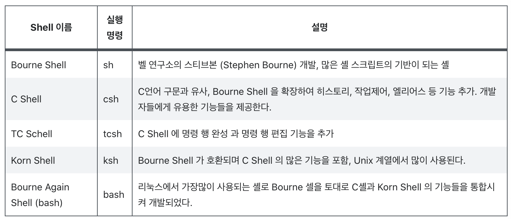

## 쉘의 개요

리눅스는 GUI 환경도 있지만 GUI 환경이 제공되기 이전 터미널 환경을 이용하여 명령어를 직접 타이핑하여 컴퓨터를 운용하였다.

현재 많은 리눅스 GUI 버전이 생겼지만 아직도 터미널 환경을 사용하는 것이 GUI처럼 직관적이지는 않지만 강력한 기능을 제공하기 때문에 여전히 많이 사용되고 있으며 이때 터미널에 입력한 명령을 해석하고 관리하는 프로그렘을 쉘(Shell)이라고 한다.

쉘은 사용자 커널 사이에 연결시켜주는 역할을 하며 사용자가 입력한 명령을 해석하여 운영체제가 해당 명령을 알아들을 수 있게 해주는 도구이다.

## 쉘의 종류

## 쉘스크립트를 이용하는 이유

단순 반복 작업을 더욱 단순하게 하거나 자동화해 시스템 관리자의 수고를 덜 수 있다.

시스템 환경에 맞춰 유연하게 적용할수 있음

### 예시
- 서버상태 감시

    서버의 상태를 감시하는 기본적인 방법 중 하나인 ping 명령어를 가지고 서버의 가용 여부를 점검하는 것이 많이 활용하고 있다.

- 서버 점검결과를 메일로 전송

    점검 결과를 콘솔이나 터미널에서 직접 확인한 후 그 결과를 메일로 전송

- 데몬 및 프로세스의 시작과 정지

    시스템을 관리하면서 수행하는 많은 절차 중에 특정 데몬 및 프로세스를 시작 또는 정지하게 하는 경우에 사용

- crontab에 스케줄 등록

    정기적으로 점검하는 항목이라면 이것조차도 번거로울 때, 특정 서비스인 xntp를 crontab에 등록하는 기능을 수행하는 쉘 스크립트다.

- 로그 파일 로테이션

    시스템을 운영하다보면 다양한 데몬 및 SW들이 구동상태나 오류사항들을 로그 파일에 계속해 축척이된다. 하지만 매순간 조금씩 증가한다고 해도 관리자들이 주의 깊게 확인하지 않으면 해당 파일량이 너무 커져버려 시스템 부하로 작용하거나 심할 경우 파일시스템의 Full 현상으로 발전하게 되고, 이를 막기위해 로그파일을 관리한다.

- ftp로 사용한 파일 자동 업로드

    여러 대의 서버에서 점검된 로그를 추출해 서버의 주기적인 분석시간을 단축시킬 수 있다.