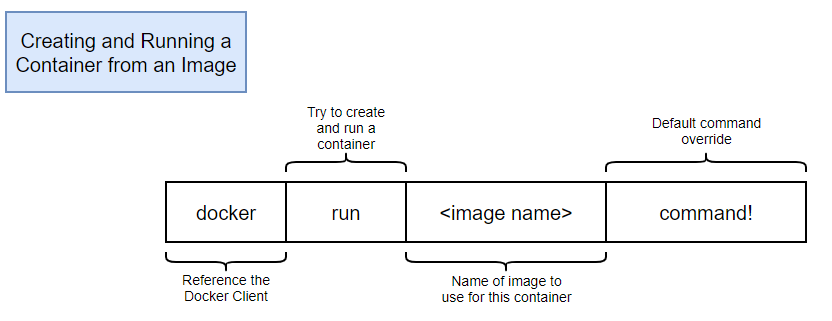
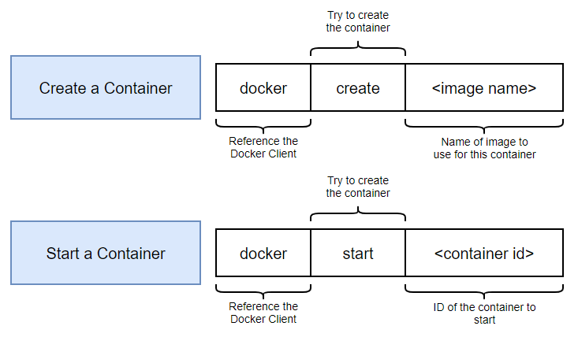
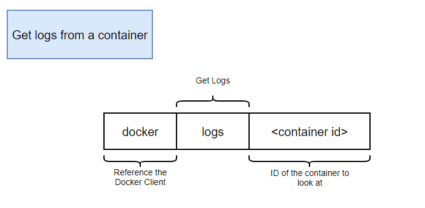
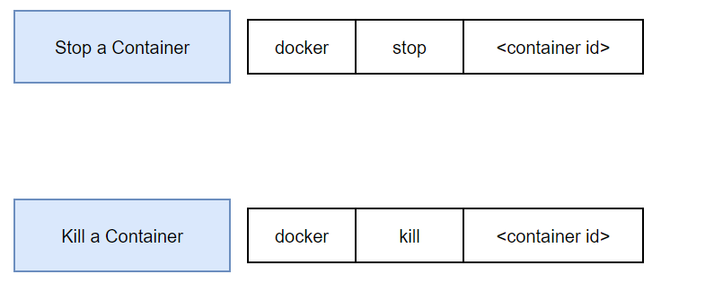
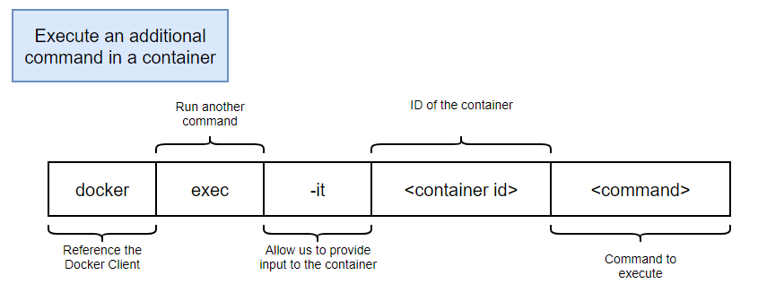

## docker run

### → Run a command in a new container



```jsx
docker run hello world
```

→ **docker** : reference the docker client

→ **run** : try to create and run a container

→ **<image name>** : Name of image to use for this container

## docker ps

### → **List all running containers**

     (**실행중인 컨테이너 리스트 보기**)

```jsx
docker ps
docker ps --all
```

## docker create & start

### → **docker run** = `docker create` + `docker start`

### → **-a** 태그는 terminal에 결과를 print해주는 역할

     **(Attach STDOUT/STDERR and rward signals)**



```docker
// Create a new container
docker create hello-world
```

```docker
// Start one or more stopped containers
docker start hello-world
```

## docker logs

### → Fetch the logs of a container



```docker
// Follow log output
docker logs --follow
```

```docker
// delete log
docker system prune
```

## docker stop & kill

### docker stop

     **SIGTERM signal**을 보낸 후, **10초 뒤**에 **SIGKILL signal**을 보내어 컨테이너를 죽임

### docker kill

     **SIGKILL signal**을 보내 컨테이너를 죽임



```docker
docker stop hello world

docker kill hello world
```

## docker exec

### → Run a command in a running container



```docker
docker exec -it hello-world sh
```

**→ i : STDIN (input)**

**→ t : STDOUT (pretty formatting)**

**→ sh (shell로 연결가능)**

(**Ctrl + D or Exit 로 탈출**)