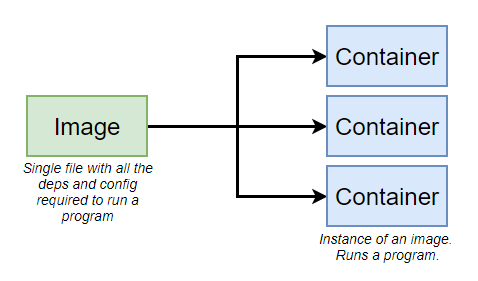

    
## **도커 (Docker)**

- 2013년 3월 Pycon Conference에서 dotCloud의 창업자인 Solomon Hykes가 The future of Linux   Containers 라는 세션을 발표하면서 처음 세상에 알려짐

- **컨테이너** 기반의 오픈소스 가상화 플랫폼

(**컨테이너 기술은 Docker가 처음 만든 것은 아님**)

- 도커를 사용하면 **환경에 구애받지 않고** 어플리케이션을 **신속하게 배포 및 확장**할 수 있음

## 도커 이미지 (Docker Image)

- 컨테이너 실행에 필요한 **파일과 설정값등을 포함**하고 있으며 **변하지 않음**

- 이미지를 실행한 상태 == 컨테이너

- 컨테이너를 실행하기 위한 모든 정보를 가지고 있기 때문에 의존성 파일을 컴파일하고 이것저것 설치할 필요성 x

- 새로운 서버가 추가되면 미리 만들어 놓은 이미지를 다운받고 컨테이너를 생성하면 끝!

## **컨테이너 (Container)**

기존 OS 가상화 방식과 달리 **OS레벨의 가상화**로 격리된 공간에서 프로세스가 동작하는 기술

- OS가 사용하는 자원을 분리하여 여러 환경을 만들 수 있음

- Guest OS가 아닌, **Host OS**에서 프로세스가 실행됨 (**같은 커널 위에서 실행**)

- 가상화를 위한 오버헤드가 거의 발생하지 않음

- 서로 다른 컴퓨팅 환경에서 어플리케이션을 안정적을 실행할 수 있으며

- **개발 환경에 구애 받지 않고 빠른 개발과 배포가 가능하다는 장점** 보유
