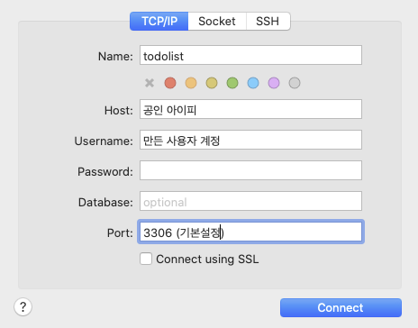

## Mysql with NCP

1. NCP에서 서버 compact로 생성
    - compact cpu 2개로 골라서 만들었음
    - 포트포워딩 1128로 해줌
    - ACG는 22, 443, 3306, 80으로 포트 열어줌
2. 우분투 업그레이드 및 한글 설정

```jsx
0. 우분투 접속 -> ssh root@'서버 공인 ip' -p '포트포워딩한 포트'
1. sudo apt-get update
2. sudo apt-get upgrade
3. sudo apt-get install language-pack-ko
4. sudo locale-gen ko_KR.UTF-8
5. locale
6. sudo -i
7. cat << 'EOF' > /etc/default/locale
	 LANG="ko_KR.UTF-8"
	 LANGUAGE="ko_KR:ko:en_US:en"
	 EOF
8. 재부팅
```

1. Mysql 설치
    - 중간에 root password를 꼭 넣어주어야 합니다.
    - 패스워드 분실시 새로 설치가 빠름 (클라우드라서)
    - OS 버전과 MySQL 버전에 따라 설치방법이 달라질 수 있으므로 검색을 활용한다.

    ```jsx
    1. sudo apt install mysql-server
    2. sudo systemctl start mysql
    3. sudo mysql_secure_installation
    	- mysql_secure_installation 시 읽어보고 yes or no를 누르기
    ```

2. Mysql 활용
    1. Mysql 접속
        - sudo mysql -u root -p → 설치시 설정한 비밀번호를 통해 접속
    2. 사용자 만들기
        - create user '2oneweek'@'%' identified by '비밀번호'
            - '사용자 이름'@'모든 아이피에 대해서 한다는건 %로 표시' 뒤에는 비번
    3. 사용자 권한 주기
        - 5.7버전
        - 8.0버전
    4. 비번 policy 바꾸기
        - SET GLOBAL validate_password_policy=LOW;
    5. Mysql 외부 접속허용 하기
        - cd /etc/mysql/mysql.conf.d/ 로 이동
        - vi mysqld.cnf → bind-address=127.0.0.1을 0.0.0.0으로 바꿔주기
    6. Mysql 사용자 정보 알아내기
        - SELECT SUBSTRING_INDEX(USER(), '@', -1) AS ip, @@hostname as hostname, @@port as port, DATABASE() as current_database;
    7. Mysql 나가기 
        - quit
    8. Mysql 명령어

        ```jsx
        1. Mysql 시작
        	service mysql start

        2. Mysql 정지
        	service mysql stop

        3. Mysql 재시작
        	service mysql restart

        4. Mysql 상태확인
        	service mysql status
        ```

3. local Mysql workbench에서 원격 접속하기 (mac인 경우 sequel ace 사용)
    - Sequel ace 설치
        - brew cask install sequel-ace

    

4. 데이터 베이스

    ```jsx
    1. database 만들기
    	create database 'db 이름';

    2. database 조회
    	show databases;

    3. db 선택
    	use 'db 이름';
    ```

5. DB table (예시)

```jsx
DROP TABLE IF EXISTS USER;
CREATE TABLE USER (
    USERID INT PRIMARY KEY AUTO_INCREMENT,
    EMAIL VARCHAR(64) UNIQUE, // UNIQUE를 넣으면 알아서 DB에 안들어감
    NICKNAME VARCHAR(64) UNIQUE,
    PASSWORD VARCHAR(64),
    COMMENT TEXT,
    );
```