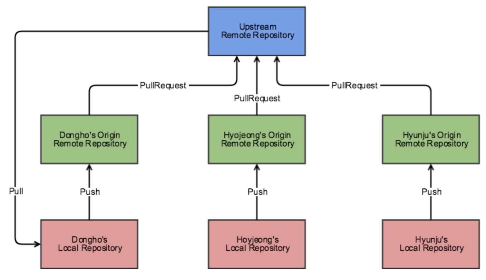
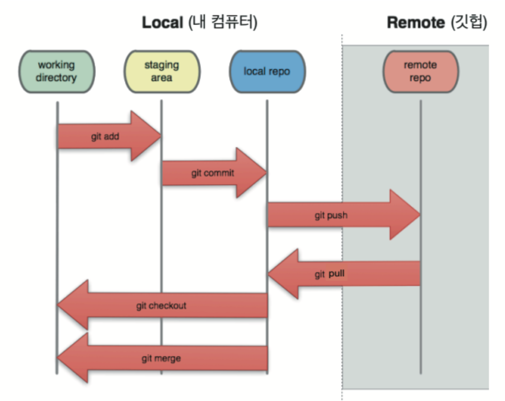
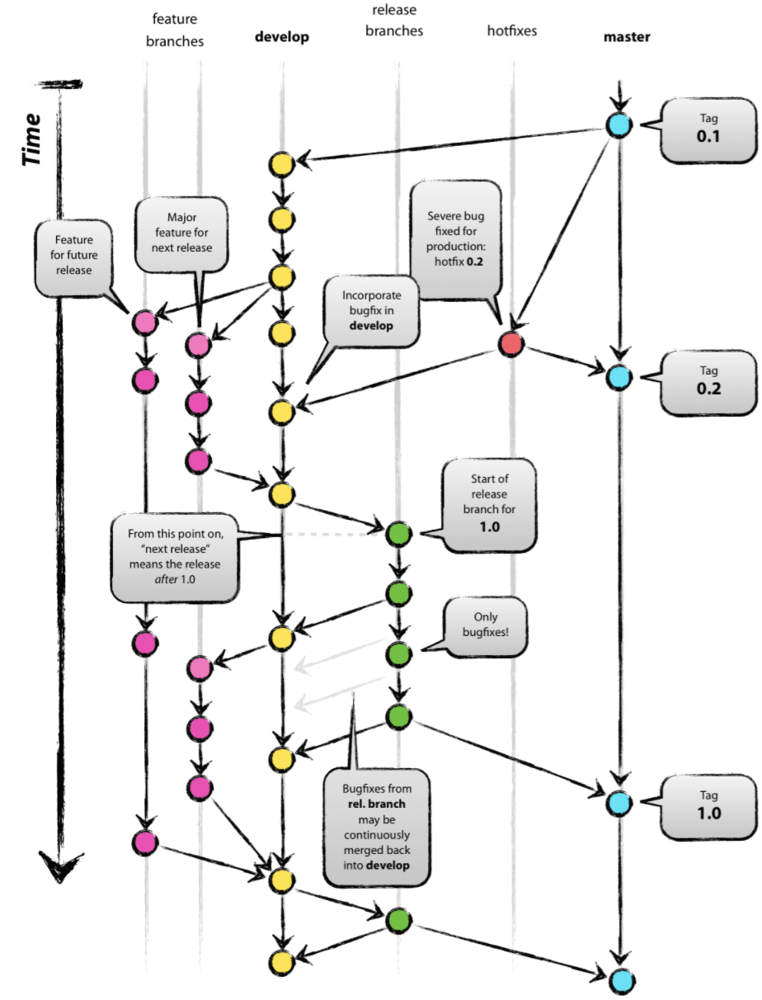
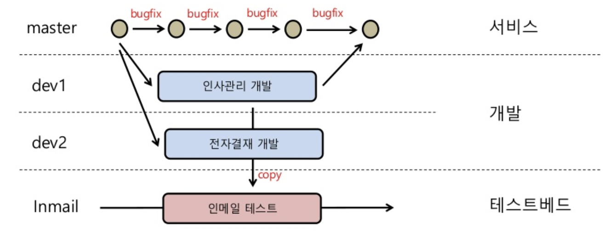
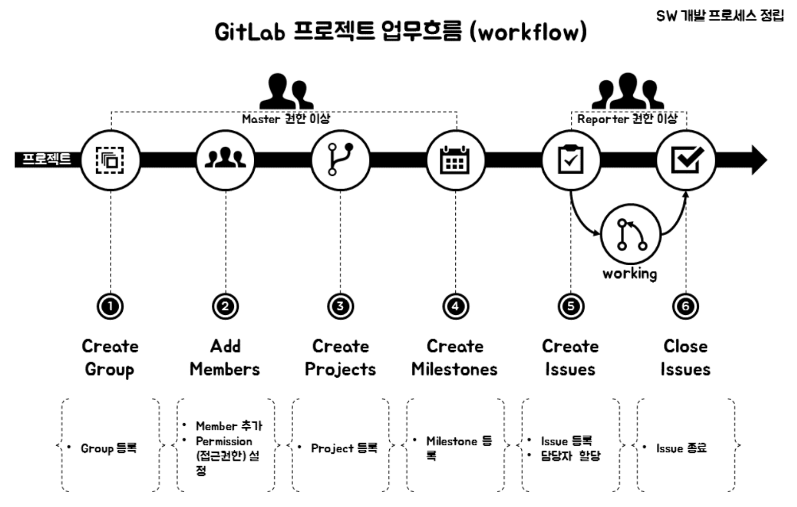

## 원본 저장소에서 fork해서, PR을 보낼때 흐름에 대한 이해

- fork를 통해 개인 원격 저장소로 원래 repo를 가지고 온다.

- 로컬에 개인 원격 저장소를 remote한다.

- 개인 branch를 만들어 해당 branch에 commit과 push를 한다.

- PR을 보내기 전까지 원래 repo에는 내 commit이 반영되지 않는다.

- PR을 받은 관리자가 merge pull request를 하게되면, 이후 원래 repo에 내 commit이 반영된다. 

## git add와 git commit을 할 때 내부에서 일어나는 동작

- git add와 commit을 통해서는 원격 repo에 영향을 줄 수 없다.

- git push를 통해서만 원격 repo에 영향을 줄 수 있다.

- git add를 하더라도 commit을 하지 않으면 local repo에 영향을 줄 수 없다.

## 실무에서 사용하는 workflow.. 왜 필요할까?

- 아무리 잘되어 있는 협업 툴이라고 해도 모두가 동의하는 어떠한 규칙이 없으면 제대로 workflow가 흘러갈 수 없다고 생각한다.

- 서로간의 합의가 없는 협업툴은 효율을 저하시키며, 프로젝트 자체가 망가질 수 있기 때문이다.

- git flow, git workflow, gitlab workflow의 장단점을 살펴보려고 한다.

### Git flow

- 서로 다른 5개의 역할을 담당하는 브랜치로 쪼갠다.

- 최종 단계를 관리하는 Master

- 다음 릴리즈 버전을 관리하는 Develop

- Develop에서 파생되어 기능구현을 이유로 만들어진 Feature

- Mater 브랜치와의 결합에 대해 버그같은 것을 테스트하는 Release

- Master 브랜치가 버그가 발생했을때, 파생되는 Hotfix

- 하지만 이는 복잡하고 번거로워 효율적이지 못하다는 지적이 많다.

### git workflow

- 기본적인 구성은 Master, Develop 1~n 단계, test로 크게 3가지로 분류가 된다.
- master branch를 언제든지 배포 가능하다.
- 새로운 일을 시작하기 전에 mster 에서 브런치를 생성한다면 이름을 명확하게 명시해야된다.
- 위 git flow보다 단순하며 직관적이다.

### gitlab workflow

- GitLab을 이용하여 팀을 구성(Group, Member, Permission)한 후, 업무를 계획(Milestone)하고 업무 세분화하여 팀원에게 배정(Issue)하는 단계

- gitlab의 순서
    1. group등록
    2. Member 등록 및 Permission(접근권한) 설정
    3. Project 등록
    4. Milestone 등록
    5. Issue 등록 및 Assign
    6. 업무진행 및 Issue 종료
