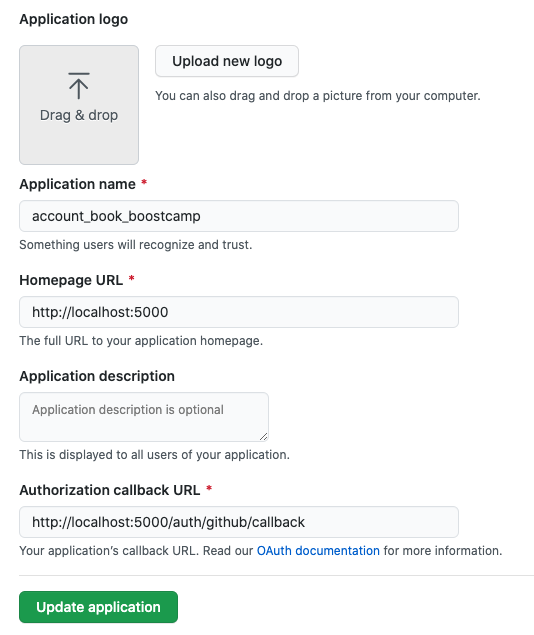
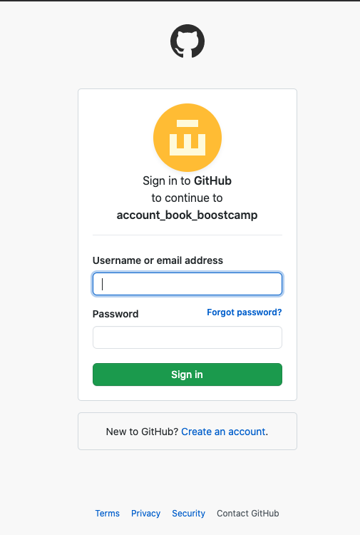

- application 만들기 (참고 URL)

    [Build software better, together](https://github.com/settings/applications/new)

- application 설정



- npm 라이브러리 설치

```jsx
npm install passport-github
```

- passport.js

```jsx
const { Strategy: GithubStrategy } = require("passport-github");

const githubConfig = {
  clientID: process.env.GITHUB_CLIENT_ID,
  clientSecret: process.env.GITHUB_CLIENT_SECRET,
  callbackURL: "http://localhost:5000/auth/github/callback",
};

const githubLoginVerify = async (accessToken, refreshToken, profile, done) => {
  const {
    _json: { id, login, node_id },
  } = profile;
  try {
    const user = await UserModel.findOne({
      where: { id: id },
    });

    if (user) {
      return done(null, user);
    }

    if (!user) {
      const addNewUser = await UserModel.create({
        id: id,
        nickname: login,
        password: node_id,
      });
      return done(null, addNewUser);
    }

    return done(null, false, { msg: "올바르지 않은 인증정보 입니다." });
  } catch (error) {
    console.error(error);
    return done(error);
  }
};

// module에 추가해주기
passport.use("github", new GithubStrategy(githubConfig, githubLoginVerify));

```

- github passport 사용시 session:false를 넣어줘야함 세션 오류 안뜸

```jsx
router.get("/auth/github", passport.authenticate("github", { session: false }));
router.get(
  "/auth/github/callback",
  passport.authenticate("github", { session: false }),
  (req, res) => {
    res.json({ msg: "깃헙 로그인 성공띠" });
  }
);
```

- 실행화면




- 참고 자료

[NODE JS - Github 으로 로그인하기 (passport)](https://m.blog.naver.com/PostView.nhn?blogId=dydals56789&logNo=221885818627&categoryNo=0&proxyReferer=https:%2F%2Fwww.google.com%2F)